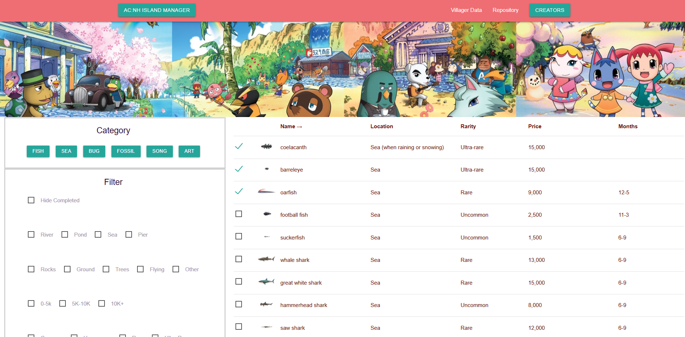
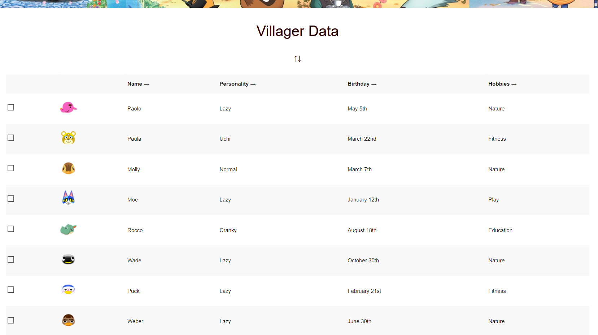

<<<<<<< HEAD
# Animal

## Description
- This Website was built to help end-users keep track of their villages and manage their collectibles of all the different parts of Animal Crossing: New Horizons in one central hub.

## Functionality (Main Page):
- End user first selects the category that they wish to display on the page. This will load all the items of that category, along with the relevant data of each such as:
    - Their names
    - Locations
    - Rarity
    - Selling/Buying Price
    - Months Available

- End users are also given checkboxes which they can use to indicate whether they have successfully obtained the item or not. This selection will remain saved in the local storage and persist when the user reloads/revisits the page. 

- After the end user selects a category, they also have the option to select a filter out of the many available to them. The filters provided are as thus:
    - Hide Completed Items
    - Locations (for fish)
    - Locations (for bugs)
    - Selling/Buying Price (separated in <5k, 5k-10k, >10k)
    - Rarity of the Item

- Along with the Filter options are also sort functions. By clicking on the header of each column of the data, the end user will be able to sort alphabetically/numerically the data that is presented to them. 
#

## Functionality (Villagers Page):
- When the Villagers Data button is clicked, the end user is sent to a page that has a list of all the villagers that are available in the game, along with their moods, personalities, birthdates, etc. 

- This is so that the user can find which villagers they would like to have on their Island, and to also keep track of which ones they have already obtained via the checkboxes. These checkboxes, similarily to in the Main page, will be kept in local storage and persist when the end user refreshes/revisits the page.

- Similarily to the Main page, the Villagers page also has a sort function that can be used to sort any of the columns alphabetically. 
#
## Live Site: 
acnhislandmanager.info

## Repository: 
https://rallen4.github.io/project1-animal-crossing/
#
## Credits: 
### Jonathan Newman - Project Manager 
    - https://github.com/specsnstats
### Ryan Allen - Github Coordinator
    - https://github.com/Rallen4
### Kellie Kumasaka - Lead Front-End Engineer
    - https://github.com/kelliekumasaka
### Charlotte Hulseman - Lead Front-End Developer
    - https://github.com/charlottehulseman
#
### with the help of our teacher, teachers assistants, and tutors.
=======
# Animal Crossing New Horizons Island Manager

Our end 
>>>>>>> dev
